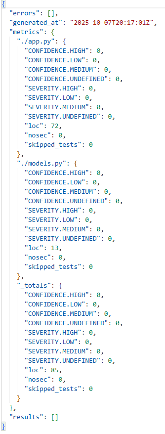
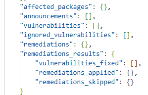

# Secure REST API (Lab 1)

## Описание
Простое защищённое REST API на Flask с аутентификацией через JWT.

### Эндпоинты

- `POST /auth/login`  
  Тело: `{"username": "admin", "password": "securepassword123"}`  
  Ответ: `{"token": "..."}`

- `GET /api/data`  
  Заголовок: `Authorization: <JWT>`  
  Ответ: данные только для аутентифицированных пользователей.

- `POST /api/comments`  
  Заголовок: `Authorization: <JWT>`  
  Тело: `{"comment": ""}`  
  Комментарий автоматически экранируется (защита от XSS).

## Реализованные меры защиты

- **SQLi**:
  - Для взаимодействия с базой данных SQLite используется ORM SQLAlchemy. Все запросы к БД (например, User.query.filter_by(username=...)) автоматически преобразуются в параметризованные SQL-запросы, что полностью исключает возможность внедрения SQL-кода через пользовательский ввод. Конкатенация строк для формирования SQL не используется. 
- **XSS**: все пользовательские строки экранируются через `html.escape()`.
- **Broken Authentication**:
  - Пароли хэшируются с помощью `bcrypt`.
  - Аутентификация через JWT с 1-часовым сроком действия.
  - Все защищённые эндпоинты проверяют токен.

## CI/CD

Настроены GitHub Actions:
- **SAST**: `bandit` сканирует код на уязвимости.
- **SCA**: `safety` проверяет зависимости.

### Скриншоты отчётов

* **bandit**
  * 

* **safety**
  * 
